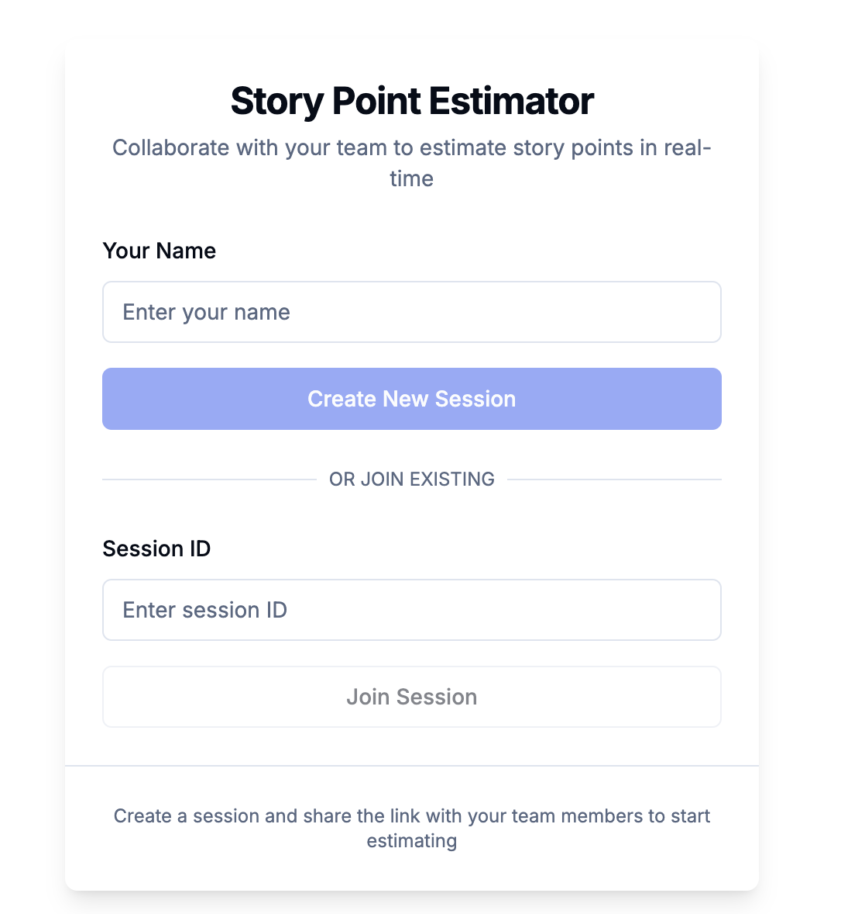

# ScrumPointing

## 📋 Table of Contents

- [Overview](#overview)
- [Features](#features)
- [Technology Stack](#technology-stack)

## 🔍 Overview

The Scrum Meeting Story Estimator is designed to streamline  the story point estimation process in agile teams. It provides a digital alternative to physical planning poker cards, allowing distributed teams to collaborate effectively during sprint planning sessions.

This tool enables teams to:

- Conduct estimation sessions in real-time
- Vote anonymously until results are revealed
- Track participation and consensus
- Manage estimation sessions with automatic expiration
- Visualize results for better decision-making

Perfect for remote and distributed teams, this application helps maintain the collaborative nature of planning poker while eliminating the need for physical cards or in-person meetings.

## ✨ Features

### Core Features

- **Real-time collaboration**: Multiple team members can join a session simultaneously
- **Anonymous voting**: Team members can vote without seeing others' votes until revealed
- **Session management**: Create and join sessions with unique IDs
- **Role-based actions**: Session hosts can reveal votes and start new rounds
- **Session expiration**: Sessions automatically expire after 1 hour to manage resources
- **Responsive design**: Works on desktop and mobile devices

### Advanced Features

- **Automatic cleanup**: Expired sessions are automatically removed from the database
- **Session timer**: Visual countdown showing time remaining in the session
- **Results analysis**: View average estimates and check for consensus
- **Participant tracking**: See who has joined and who has voted
- **Share functionality**: Easily share session links with team members
- **New round reset**: Clear all votes and start fresh for the next story

### User Experience

- **Simple interface**: Intuitive design requires no training
- **Mobile-friendly**: Use on any device during meetings
- **Real-time updates**: See votes appear as they happen
- **Visual feedback**: Clear indicators for session status and voting progress

## 🔧 Technology Stack

### Frontend

- **Framework**: Next.js 14 with App Router
- **Language**: TypeScript
- **UI Library**: React
- **Styling**: Tailwind CSS with shadcn/ui components
- **State Management**: React hooks and context API

### Backend

- **Database**: PostgreSQL (via Supabase)
- **Real-time Communication**: Supabase Realtime
- **API Routes**: Next.js API routes
- **Authentication**: Simple session-based identification

### Infrastructure

- **Hosting**: Vercel (frontend)
- **Database Hosting**: Supabase
- **Version Control**: Git
- **CI/CD**: Vercel deployment pipeline

### Key Libraries

- **nanoid**: For generating unique session and user IDs
- **lucide-react**: For icons and visual elements
- **next/navigation**: For client-side routing

### Architecture

The application follows a modern, component-based architecture with:

- **Server Components**: For improved performance and SEO
- **Client Components**: For interactive elements
- **API Routes**: For server-side operations
- **Real-time Subscriptions**: For live updates across clients

This technology stack ensures a responsive, scalable, and maintainable application that provides a seamless user experience for agile teams conducting estimation sessions.

---
